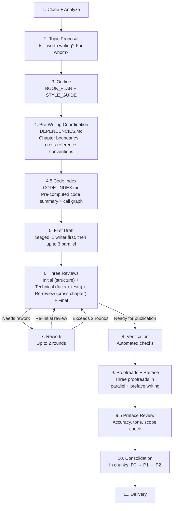

# Tech Insider — Deep Source Code Analysis Book Generator

An automated, publication-grade technical book pipeline powered by Agent Teams. From cloning a repository to delivering a finished manuscript — fully automated end-to-end.

## Inspiration

This plugin was born from a real publishing project: using Claude Code's Agent Teams model, we produced a 67,000-word, 16-chapter, 4-appendix deep analysis book for [Hermes Agent](https://github.com/NousResearch/hermes-agent) (50K+ stars, MIT). The process included:

- Up to 4 generic Writers writing in parallel (staged: 1 first, then up to 3)
- 4 review rounds (initial chapter-by-chapter structure + technical fact-checking + re-review for cross-chapter consistency + final review for overall quality)
- 3 proofreading passes (first pass: text; second pass: cross-references; third pass: readability read-through)
- 1 Editor-in-Chief for final consolidation
- Cover design, preface writing, appendix composition

This plugin packages that entire workflow into a reusable Claude Code plugin.

## Quick Start

### Option 1: Install via Marketplace (Recommended)

```bash
# Add marketplace (if using a Git repository)
/plugin marketplace add https://github.com/AngusFu/tech-insider.git

# Install the plugin
/plugin install tech-insider@tech-insider-marketplace

# Run in Claude Code
/tech-insider:make-book https://github.com/NousResearch/hermes-agent \
  --title "Hermes Agent Deep Analysis" \
  --subtitle "Understanding Self-Evolving AI Agent Architecture from Source Code"
```

### Option 2: Local Development Mode

```bash
claude --plugin-dir /path/to/tech-insider

# Then run in Claude Code:
/tech-insider:make-book https://github.com/NousResearch/hermes-agent \
  --title "Hermes Agent Deep Analysis" \
  --subtitle "Understanding Self-Evolving AI Agent Architecture from Source Code"
```

### Two Launch Methods

| Method | Trigger | Execution | Use Case |
|--------|---------|-----------|----------|
| `/tech-insider:make-book` | Command | Orchestrates subagents for parallel execution | Full book production |
| `book-pipeline` skill | Skill tool | Orchestrates subagents for parallel execution | Same as above, skill entry point |

Both share the same pipeline logic (`skills/book-pipeline/SKILL.md`). The command only handles parameter parsing before loading the skill.

## Architecture

```
tech-insider/
├── .claude-plugin/
│   └── plugin.json              # Plugin manifest
├── skills/
│   ├── book-planner/            # Planner: analyze codebase, draft outline, style guide
│   ├── book-writer-template/    # Writer template: chapter writing standards
│   ├── book-consistency-reviewer/ # Cross-chapter consistency review (re-review)
│   ├── book-proofreader/        # Proofreading: text / cross-references / readability
│   └── book-pipeline/           # Pipeline orchestration: full flow + parallel subagents
├── agents/
│   ├── book-planner.md            # Planner Agent (general, dynamically generates chapters)
│   ├── book-writer.md             # Generic Writer: any chapter type, assigned from BOOK_PLAN.md
│   ├── book-chapter-reviewer.md   # Chapter-by-chapter structure review (initial review)
│   ├── book-technical-reviewer.md # Technical fact-checking (code logic / architecture / data validation)
│   ├── book-verifier.md           # Automated structure verification
│   ├── book-editor-in-chief.md    # Editor-in-Chief for consolidation
│   └── book-preface-writer.md     # Preface writing (Phase 9)
├── commands/
│   └── make-book.md               # /tech-insider:make-book launch command
├── docs/
│   └── workflow-experience.md   # Workflow experience summary
├── CHANGELOG.md
├── CONTRIBUTING.md
├── LICENSE
├── README.md
└── SECURITY.md

Generated output structure (within the book directory):

<project>-book/
├── ch01-*.md … ch16-*.md        # Chapters (deliverables)
├── preface.md                    # Preface (deliverable)
├── book-final.md                 # Consolidated final manuscript (deliverable)
├── TOPIC.md                      # Topic proposal
├── BOOK_PLAN.md                  # Chapter outline
├── STYLE_GUIDE.md                # Writing style guide
├── DEPENDENCIES.md               # Chapter dependency graph
├── CODE_INDEX.md                 # Pre-computed code summary + call graph
├── EDITORIAL_PLAN.md             # Editorial pipeline plan
└── .work/                        # Intermediate artifacts (hidden directory)
    ├── review-chXX.md            # Initial review reports
    ├── tech-review-chXX.md       # Technical review reports
    ├── review-consistency.md     # Cross-chapter consistency report
    ├── verification-status.md    # Verification status
    └── proofread-1/2/3.md        # Proofreading reports
```

## Pipeline Flow



## Chapter Structure Template

Each chapter strictly follows:

```
> Opening metaphor / quote

\`\`\`mermaid
(architecture diagram / flowchart / state diagram)
\`\`\`

## Technical Deep Dive (code references with file:line)
### Design Decision Box (decision / alternatives / trade-offs / rationale)

## Stop and Think (2-3 reflective questions)
## Transferable Design Principles (3-5 transferable principles)
```

## Lessons Learned (from the Hermes Project)

Here is what we learned from actual production, now built into the plugin:

1. **Study reference books first** — Writing without reading reference material first causes style drift
2. **Mermaid is the only choice** — No ASCII art; all diagrams must be renderable
3. **Main Agent does not do the work** — Main only coordinates; all work is delegated to subagents
4. **Style guide must be created before writing** — Without unified terminology and structure, chapters will diverge
5. **Content overlap must be resolved upfront** — Each concept gets one home chapter; others cross-reference only
6. **Three proofreading passes** — Text proofreading is the first pass; cross-reference validation is the second; readability read-through is the third
7. **Appendices must come after the main text** — Easy to misplace during consolidation
8. **Pre-index the codebase** — Writers and reviewers work against CODE_INDEX.md summaries instead of raw source to cut token cost
9. **Staged writer launch** — Foundation writer goes first; others follow after style checkpoint
10. **Technical fact-checking is the core quality gate** — Format checks cannot replace code verification; stated code logic must match actual source; run test suite when available

## Testing

```bash
# Test the plugin locally
claude --plugin-dir /path/to/tech-insider

# Verify plugin structure
ls -la .claude-plugin/plugin.json
ls -la skills/*/SKILL.md
ls -la agents/*.md
ls -la commands/make-book.md
```

## License

MIT — see [LICENSE](LICENSE)

## Contributing

See [CONTRIBUTING.md](CONTRIBUTING.md)

## Security

See [SECURITY.md](SECURITY.md)

## Changelog

See [CHANGELOG.md](CHANGELOG.md)
