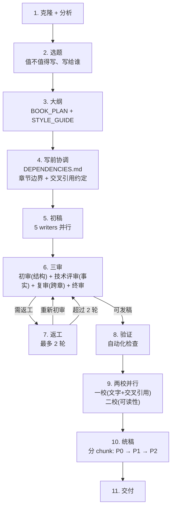

# Source Code Book — 源码深度解析书籍生成器

基于 Agent Teams 的出版级技术书籍全自动管线。从克隆一份开源代码到输出终稿，全流程自动化。

## 灵感来源

这个插件诞生于一次完整的出版实践：我们用 Claude Code 的 Agent Teams 模式，为 [Hermes Agent](https://github.com/NousResearch/hermes-agent)（50K+ stars, MIT）写了一本 6.7 万字、16 章、4 个附录的深度解析书籍。整个过程包含：

- 5 个 Writer 并行撰写
- 5 轮审稿（初审逐章结构 + 技术事实核对 + 复审跨章一致性 + 终审整体质量）
- 2 轮校对（一校：文字+交叉引用 + 二校：可读性通读）
- 1 个 Editor-in-Chief 统稿
- 封面设计、序言撰写、附录编写

这个插件把那个工作流封装成了可复用的 Claude Code 插件。

## 快速开始

### 方式一：通过 Marketplace 安装（推荐）

```bash
# 添加 marketplace（如果使用 Git 仓库）
/plugin marketplace add https://github.com/example/source-code-book-plugin.git

# 安装插件
/plugin install source-code-book@source-code-book-marketplace

# 在 Claude Code 中运行
/source-code-book:start https://github.com/NousResearch/hermes-agent \
  --title "Hermes Agent 深度解析" \
  --subtitle "从源码理解自我进化的 AI Agent 架构"
```

### 方式二：本地开发模式

```bash
claude --plugin-dir /path/to/source-code-book-plugin

# 然后在 Claude Code 中运行：
/source-code-book:start https://github.com/NousResearch/hermes-agent \
  --title "Hermes Agent 深度解析" \
  --subtitle "从源码理解自我进化的 AI Agent 架构"
```

### 两种启动方式

| 方式 | 触发 | 执行方式 | 适用场景 |
|------|------|---------|---------|
| `/source-code-book:start` | 命令 | 编排 subagent 并行执行 | 完整书籍生产 |
| `book-pipeline` skill | Skill 工具 | 编排 subagent 并行执行 | 同上，skill 入口 |

两者共享同一管线逻辑（`skills/book-pipeline/SKILL.md`），命令只做参数解析后加载 skill。

## 架构

```
source-code-book-plugin/
├── .claude-plugin/
│   └── plugin.json              # 插件清单
├── skills/
│   ├── book-planner/            # 规划器：分析代码库、制定大纲、风格指南
│   ├── book-writer-template/    # Writer 模板：章节写作规范
│   ├── book-consistency-reviewer/ # 跨章一致性审查（复审）
│   ├── book-proofreader/        # 三校校对：文字/交叉引用/可读性
│   └── book-pipeline/           # 管线编排：完整流程 + 并行 subagent
├── agents/
│   ├── book-planner.md            # 规划 Agent（通用，动态生成章节）
│   ├── book-writer-foundation.md  # Writer：基础篇（前 2-3 章）
│   ├── book-writer-core-loop.md   # Writer：核心循环篇
│   ├── book-writer-core-system.md # Writer：核心系统篇
│   ├── book-writer-tools.md       # Writer：工具/子系统篇
│   ├── book-writer-integration.md # Writer：整合与工程篇
│   ├── book-chapter-reviewer.md   # 逐章结构审查（初审）
│   ├── book-technical-reviewer.md # 技术事实核对（代码逻辑/架构/数据验证）
│   ├── book-verifier.md           # 自动化结构验证
│   └── book-editor-in-chief.md    # 统稿主编
├── commands/
│   └── start.md                 # /source-code-book:start 启动命令
├── docs/
│   └── workflow-experience.md   # 工作流经验总结
├── CHANGELOG.md
├── CONTRIBUTING.md
├── LICENSE
├── README.md
└── SECURITY.md
```

## 管线流程



## 章节结构模板

每章严格遵循：

```
> 开头隐喻/名言

\`\`\`mermaid
（架构图/流程图/状态图）
\`\`\`

## 技术深潜（代码引用带 file:line）
### 设计决策框（决策/备选/权衡/理由）

## 停下来想一想（2-3 个反思问题）
## 可迁移的设计原则（3-5 条可迁移原则）
```

## 经验教训（来自 Hermes 实践）

我们在实际工作中学到了这些教训，已内建到插件中：

1. **必须先研究参考书** — 不先读参考书就写，风格会偏移
2. **Mermaid 是唯一选择** — 禁止 ASCII 图，所有图必须可渲染
3. **Main Agent 不干活** — Main 只负责协调，所有工作委派给 subagent
4. **风格指南必须在写之前创建** — 不统一术语和结构，各章风格会分裂
5. **内容重合必须提前处理** — 每个概念指定一个主章节，其他只做交叉引用
6. **两校合并** — 文字校对和交叉引用合并为一校，可读性单独为二校，节省 token 预算
7. **Appendix 必须在正文之后** — 统稿时容易拼错位置
9. **进度必须及时反馈** — 不能让 main agent 干等所有 subagent 跑完才汇报
10. **技术事实核对是核心质量门** — 格式检查不能替代代码验证，章节里说的代码逻辑必须和实际源码一致

## 测试

```bash
# 本地测试插件
claude --plugin-dir /path/to/source-code-book-plugin

# 验证插件结构
ls -la .claude-plugin/plugin.json
ls -la skills/*/SKILL.md
ls -la agents/*.md
ls -la commands/start.md
```

## License

MIT — see [LICENSE](LICENSE)

## Contributing

See [CONTRIBUTING.md](CONTRIBUTING.md)

## Security

See [SECURITY.md](SECURITY.md)

## Changelog

See [CHANGELOG.md](CHANGELOG.md)
